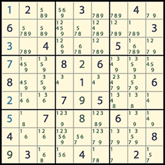

# wisk2sudoku
A Sudoku solver for the course "Applied Mathematics 2" at the KHLeuven.

## TODO
Everything

- [ ] Collect examples and put them in the examples directory
- [ ] Write a way to auto-test the code
- [ ] Write function that can solve easy sudoku's
- [ ] Write a function that can solve all sudoku's
- [ ] Go to class
- [ ] Get good grades!

## Scilab relevant commands & functions
|Code           | Description |
|---------------|-------------|
| `tic ... toc` | Duration between **tic** and **toc** command |
