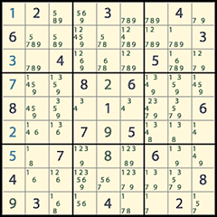

# wisk2sudoku
A Sudoku solver for the course "Applied Mathematics 2" at the KHLeuven.

## Examples
See [examples.md](examples.md)
## TODO
Everything

- [ ] Read deadlines and put those in todo section
- [x] Collect examples and put them in the example file
- [ ] Write a way to auto-test the code
- [ ] Write function that can solve easy sudoku's
- [ ] Write a function that can solve all sudoku's
- [ ] Go to class
- [ ] Get good grades!

## Scilab relevant commands & functions
|Code               | Description |
|-------------------|-------------|
| `tic ... toc`     | [Duration between **tic** and **toc** command](http://help.scilab.org/docs/5.5.2/en_US/tic.html) |
| `mfile2sci(...)`  | [Matlab M-file to Scilab conversion](http://help.scilab.org/docs/5.5.2/en_US/mfile2sci.html) |
